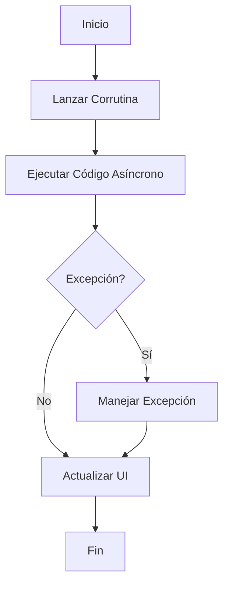

# Corrutinas en Kotlin Android

Las corrutinas en Kotlin simplifican la programación asíncrona y permiten escribir código de manera secuencial sin bloquear el hilo principal.

## Configuración

1. En `libs.versions.toml` debemos agregar las versiones de los paquetes necesarios y nombrar las librerías. Luego, añadimos las dependencias en `build.gradle.kts`.
`build.gradle`:

    ```kotlin
    // libs.versions.toml
    [versions]
    coroutines = "1.7.3"
    lifecycle = "2.6.1"
    retrofit = "2.9.0"
    retrofit-coroutines-adapter = "0.9.2"
    gson = "2.9.0"

    [libraries]
    coroutines-core = { module = "org.jetbrains.kotlinx:kotlinx-coroutines-core", version.ref = "coroutines" }
    coroutines-android = { module = "org.jetbrains.kotlinx:kotlinx-coroutines-android", version.ref = "coroutines" }
    lifecycle-runtime-ktx = { module = "androidx.lifecycle:lifecycle-runtime-ktx", version.ref = "lifecycle" }
    retrofit = { module = "com.squareup.retrofit2:retrofit", version.ref = "retrofit" }
    retrofit-gson = { module = "com.squareup.retrofit2:converter-gson", version.ref = "gson" }
    retrofit-coroutines-adapter = { module = "com.jakewharton.retrofit:retrofit2-kotlin-coroutines-adapter", version.ref = "retrofit-coroutines-adapter" }
    ```

## Uso Básico

### Lanzar una Corrutina

Para lanzar una corrutina, se utiliza el constructor `launch` dentro de un `CoroutineScope`:

```kotlin
import kotlinx.coroutines.*

fun main() {
    GlobalScope.launch {
        // Código de la corrutina
    }
}
```

### Ejemplo en una Actividad

```kotlin
import kotlinx.coroutines.*

class MainActivity : AppCompatActivity() {

    override fun onCreate(savedInstanceState: Bundle?) {
        super.onCreate(savedInstanceState)
        setContentView(R.layout.activity_main)

        // Lanzar una corrutina en el scope de la actividad
        lifecycleScope.launch {
            val result = fetchData()
            // Actualizar la UI con el resultado
        }
    }

    private suspend fun fetchData(): String {
        // Simular una operación de red
        delay(1000)
        return "Datos obtenidos"
    }
}
```

### Manejo de Excepciones

Para manejar excepciones dentro de una corrutina, se puede usar `try-catch`:

```kotlin
lifecycleScope.launch {
    try {
        val result = fetchData()
        // Actualizar la UI con el resultado
    } catch (e: Exception) {
        // Manejar la excepción
    }
}
```

### Corrutinas con Retrofit

Para usar corrutinas con Retrofit, se debe definir la interfaz del servicio con funciones `suspend`:

```kotlin
interface ApiService {
    @GET("endpoint")
    suspend fun getData(): Response<Data>
}
```

Luego, se puede llamar a esta función dentro de una corrutina:

```kotlin
lifecycleScope.launch {
    val response = apiService.getData()
    if (response.isSuccessful) {
        val data = response.body()
        // Actualizar la UI con los datos
    }
}
```

## Esquema de Funcionamiento de Corrutinas en Kotlin Android



Este esquema muestra el flujo básico de una corrutina en Kotlin Android.

## Conclusión

Las corrutinas en Kotlin proporcionan una forma sencilla y eficiente de manejar operaciones asíncronas en Android, mejorando la legibilidad y mantenibilidad del código.
